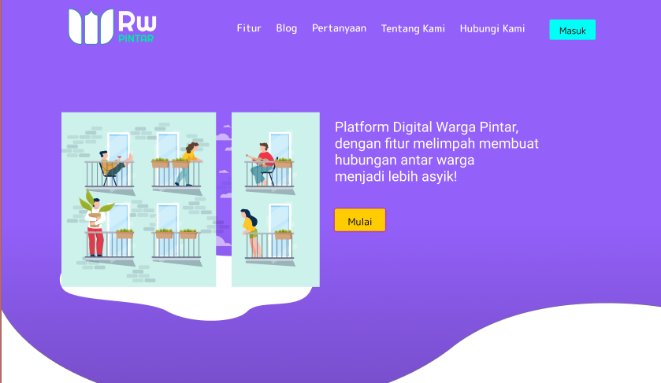

# RWpintar #

It's already almost 1 year after the start of coronavirus outbreak.
one of the problem arise from this outbreak is related to reduced social interaction between people in communities, especially in the
neighborhood of RW (Rukun warga) where social interaction between people and citizen association is important to keep communities running.

So as one of the solution to this problem our teams decided to created an web app for citizen association and people in small neighborhood communities to
interact and managed the neighborhood by online means. 
Our project aim is to help citizen association digitalized their database, social help system and almost all of their communities facilities

## Observation and Interview Result ##
kami melakukan observasi di RW 1, Kelurahan Kebon Kelapa, Kecamatan Gambir, Jakarta pusat. Pada observasi kali ini kami mewawancarai 8 narasumber termasuk
pengurus RW dan Pengurus Karang Taruna di lingkungan RW 1 Kebon Kelapa

## Use Case Diagram ##

### Screenshot of our web app ###

## Features ##
- [ ] manajemen RW
- [ ] Database Center
- [ ] LaporRW
- [ ] JualBeli
- [ ] PanicButton
- [ ] Digitalisasi Dokumen

## Our teams ##
- Muhammad Daffa Haryadi Putra
- [GeminorumB](https://github.com/GeminorumB) \\ 1313619034
- Muhammad Ridho Rizqillah 
- [Renespeare](https://github.com/Renespeare) \\ 1313619033
- Muhammad Hafidz Hisbullah
- [DragonFly378](https://github.com/DragonFly378) \\ 1313619019

